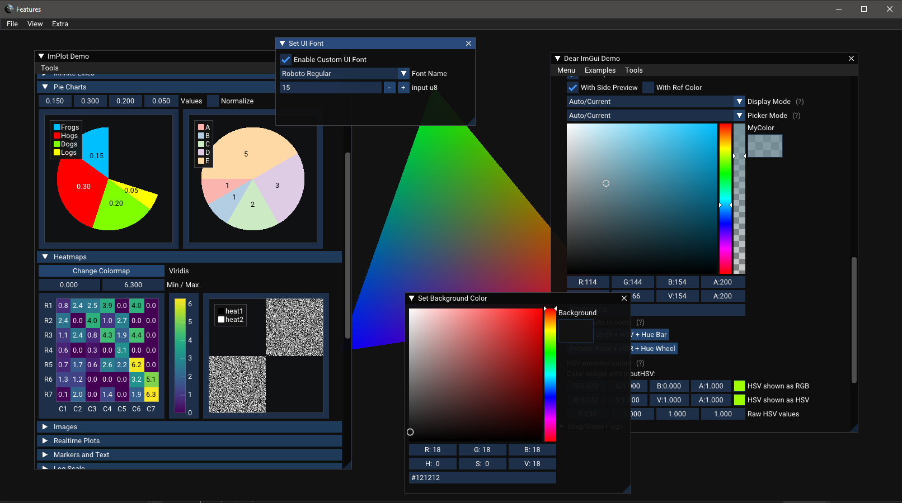
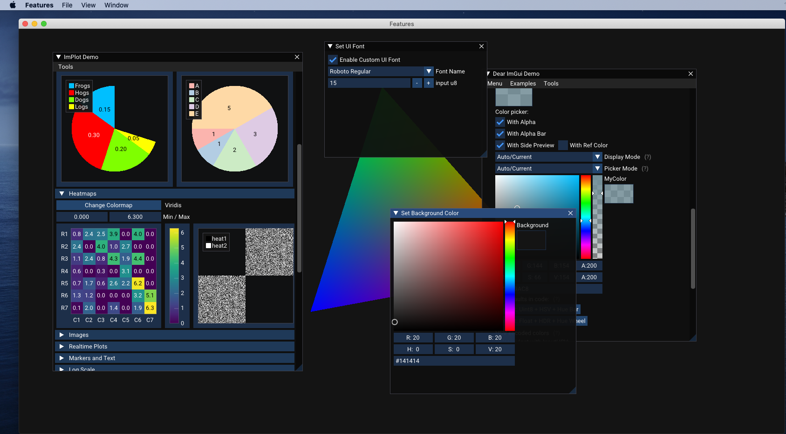

# ImFrame 
ImFrame is a lightweight framework designed to provide you with a window and graphical backend for the Dear ImGui library.  Unlike more traditional GUI frameworks, Dear ImGui is designed to be integrated into existing applications with a real-time graphics rendering loop, like you'd typically find in videogames.

## Features
ImFrame provides you with a number of features for typical application development needs:
* Comprehensive windows management using GLFW
* Automatic saving and restoring of windows position, size, and state
* Native file open, file save, and directory selection dialog boxes
* Application-specific settings storage via platform-appropriate ini file
* Image loading as an OpenGL texture
* Multiple embedded fonts to use for ImGui
* Menu wrappers for ImGui functions that provide native macOS menus

## Third Party Libraries
ImFrame integrates a number of handy third-party libraries into a single handy framework.  Some of these are hidden behind ImFrame interfaces, while some are provided as-is for your application's use.

* [Dear ImGui](https://github.com/ocornut/imgui) is a platform-independent immediate-mode GUI library.  It uses the MIT license.
* [GLFW](https://www.glfw.org/) is an OpenGL-based, cross-platform window management and input handling library.  It uses the zip/libpng license.
* [glad](https://github.com/Dav1dde/glad) is an OpenGL loading library.  It uses the MIT license.
* [Native File Dialog Extended](https://github.com/btzy/nativefiledialog-extended) is a library that invokes native file open, save, and folder select dialog boxes.  It uses the zlib license.
* [ImPlot](https://github.com/epezent/implot) is a comprehensive plotting library extension for Dear ImGui.  It uses the MIT license.
* [mINI](https://github.com/pulzed/mINI) is an ini file reader / writer.  It uses the MIT license.
* [linmath](https://github.com/datenwolf/linmath.h) is a header-only C-based linear math library for computer graphics.  It uses the WTFPL license.
* [stb_image](https://github.com/nothings/stb) is a library used for loading images.  It uses the MIT license or is public domain.

## Getting Started
ImFrame uses CMake, so integration should be straightforward using this build tool.  Just add the library to your CMake script, create an application class as required, and you should be off and running.  We've provided several example applications that should provide you with enough information to build your own app.  For example, the following code in the Minimal example shows off everything you need to do to get an application up and running with just a tiny bit of code:

``` c++
#include <ImFrame.h>

#ifdef IMFRAME_WINDOWS
#include <SDKDDKVer.h>
#define WIN32_LEAN_AND_MEAN
#include <Windows.h>
#endif

namespace Minimal
{
  class MainApp : public ImFrame::ImApp
  {
  public:
    MainApp(GLFWwindow * window) : ImFrame::ImApp(window) {}
    virtual ~MainApp() {}
    void OnUpdate() override {}
  };
}

// ImFrame main function and app creation
IMFRAME_MAIN("ImFrame", "Minimal App Demo", Minimal::MainApp)
```

This application will compile and run on Windows, macOS, and most Linux distros.

## Stability
ImFrame is still in early development, so feedback and bug reports are appreciated.  At the moment, it should expected that breaking changes may be introduced as new functionality is added, bugs are fixed, and APIs are streamlined.

## Screenshots
The following are some screenshots showing the Features demo running on Windows and macOS.

*Windows Demo*


*Mac Demo*
